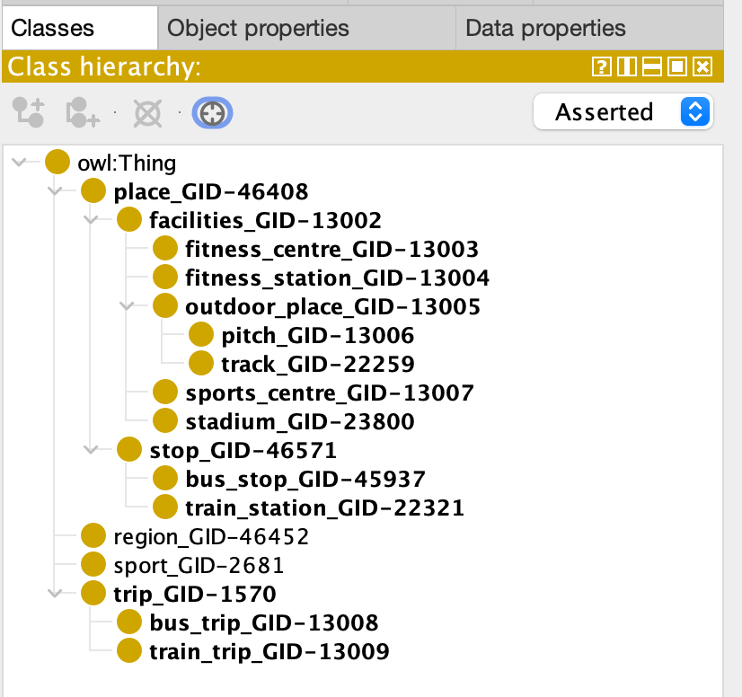
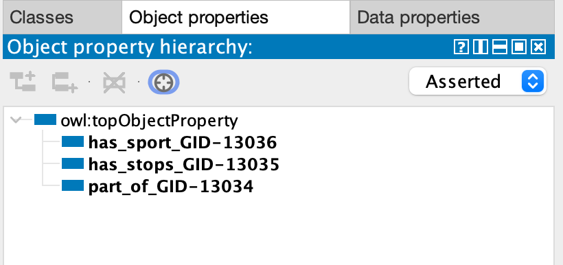
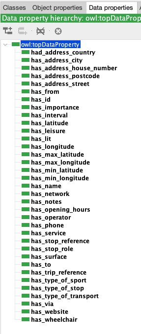

# SportsFacilitiesAndTransportationInTrento
Knowledge Graph Engineering project work about Sports Facilities and Transportation in the Trentino area, using the iTelos methodology.

## Introduction

This is a GitHub page for the Knowledge Graph Engineering project for the Fall 2023 class. This project aims to construct knowledge graph from the information about sport in Trentino, mainly the facilities.

## Materials

Github repository: https://github.com/patrick-nanys/SportsFacilitiesAndTransportationInTrentino

Report: https://github.com/patrick-nanys/SportsFacilitiesAndTransportationInTrentino/blob/main/Documentation/KGE_2023.pdf

Presentation: https://github.com/patrick-nanys/SportsFacilitiesAndTransportationInTrentino/blob/main/Documentation/KGE_presentation.pptx

## Purpose

Our project purpose is to integrate sports facilities and transportation ways in Trentino to provide a comprehensive understanding of how sports facilities are distributed across the region and how they are connected through various transportation means. 

## Dataset

The dataset was obtained from OpenStreetMaps.

## Schemas

Schemas from schema.org have been used for the project.

## ER Diagram

## Teleontology

## Knowledge graph

