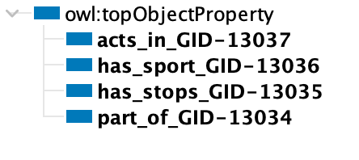
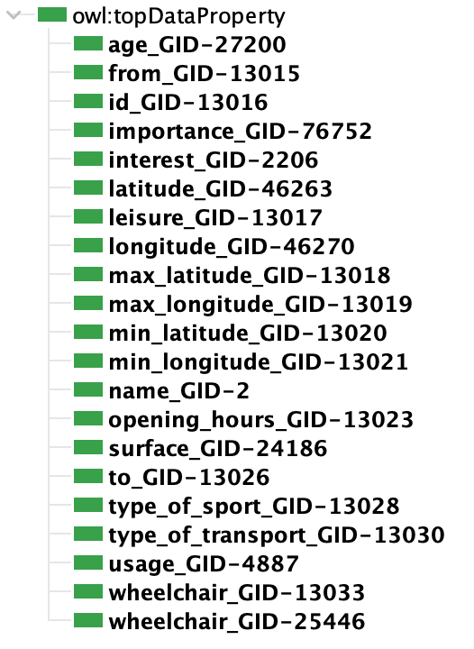

# SportsFacilitiesAndTransportationInTrento
Knowledge Graph Engineering project work about Sports Facilities and Transportation in the Trentino area, using the iTelos methodology.

## Introduction

This is a GitHub page for the Knowledge Graph Engineering project for the Fall 2023 class. This project aims to construct knowledge graph from the information about sport in Trentino, mainly the facilities.

## Materials

Github repository: https://github.com/patrick-nanys/SportsFacilitiesAndTransportationInTrentino

Report: https://github.com/patrick-nanys/SportsFacilitiesAndTransportationInTrentino/blob/main/Documentation/KGE_2023.pdf

Presentation: https://github.com/patrick-nanys/SportsFacilitiesAndTransportationInTrentino/blob/main/Documentation/KGE_presentation.pptx

## Purpose

Our project purpose is to integrate sports facilities and transportation ways in Trentino to provide a comprehensive understanding of how sports facilities are distributed across the region and how they are connected through various transportation means. 

## Competency Questions

The CQs have been created in a way to cover different scenarios and persona needs that may arise regarding transportation and sports facility needs.

1. Paolo lives in Trento and is in love with sports. Which facilities can Paolo use in Trento that is in walking distance to him?
2. Patrick lives in Povo and would like to go to a gym in the morning to work out. Which is the closest gym to him that is open at a specific time?
3. José has a son and who is in a wheelchair and they live in Trento. He wants his son to enjoy playing football. Which transportation route options do they have that is wheelchair accessible?
4. Lucia is a Volleyball fan in Rovereto and loves to watch volleyball matches, but she is not that into long walks and she prefers buses. Which urban bus route should she take to the next match that involves the least amount of walking?
5. Ginevra lives in Villazzano and she is a professional athlete. Which track has a tartan surface and where she needs to walk the least before and after practices while taking public transport?

## Schemas and Datasets

### Consumer Activities

These tasks aim to gather resources that are of "high quality and formal" nature, which have been identified as appropriate for the project.

#### Knowledge Layer

The following have been the main sources for the schemas which contained high quality resources:
- Schema.org - 
- Open Street Map - Trentino Territory Ligthweight Ontology - 

#### Data layer

The following have been the main sources for the data which contained high quality resources:
- Overpass Turbo - 
- Overpass API - 

Otherwise there have been smaller parts that were generated manually. Refer to the project report in the Information Gathering section for more information.

## ER Diagram

## Teleontology

The connections between the Etypes for the teleology can bee seen in the following table:

| extbf{Domain}                                                                                                                                                                                                                             | \textbf{ObjectProperty} | \textbf{Range}                                  |
|-------------------------------------------------------------------------------------------------------------------------------------------------------------------------------------------------------------------------------------------|-------------------------|-------------------------------------------------|
| end\_user\_GID-53816                                                                                                                                                                                                                      | acts\_in\_GID-13037     | region\_GID-46452                               |
| fitness\_centre\_GID-13003, fitness\_station\_GID-13004, pitch\_GID-13006, sports\_centre\_GID-13007, stadium\_GID-23800, track\_GID-22259                                                                                                | has\_sport\_GID-13036   | sport\_GID-2681                                 |
| bus\_trip\_GID-13008, train\_trip\_GID-13009                                                                                                                                                                                              | has\_stops\_GID-13035   | bus\_stop\_GID-45937, train\_station\_GID-22321 |
| bus\_stop\_GID-45937, bus\_trip\_GID-13008, fitness\_centre\_GID-13003, fitness\_station\_GID-13004, pitch\_GID-13006, sports\_centre\_GID-13007, stadium\_GID-23800, track\_GID-22259, train\_station\_GID-22321, train\_trip\_GID-13009 | part\_of\_GID-13034     | region\_GID-46452                               |

## Knowledge graph

[KG](https://github.com/patrick-nanys/SportsFacilitiesAndTransportationInTrentino/tree/main/Phase%205%20-%20Data%20Definition)

